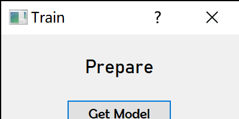
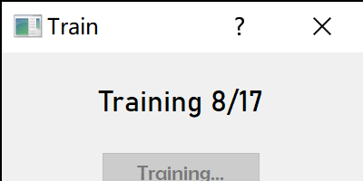
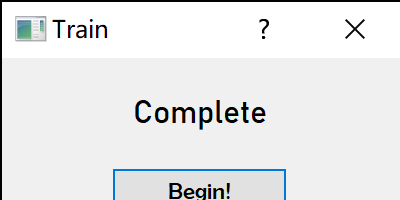
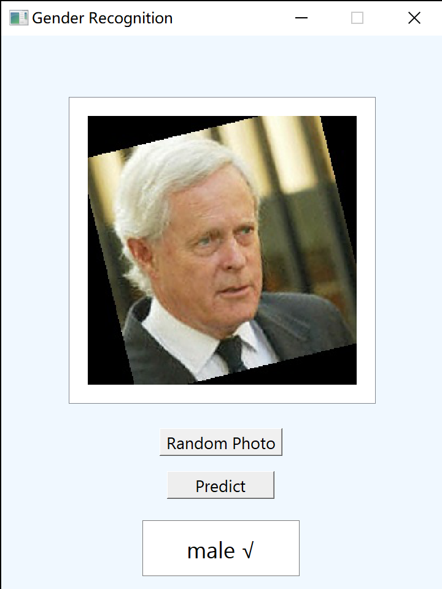

# 二分类人脸识别（性别识别）图形界面程序

大一暑假小学期的python大作业项目。我的第一个图形界面程序。

使用说明：在该目录下使用命令行python main.py。（虽然由于没有上传数据集，并不能正常使用...）

（所以代码仅供参考学习...）

环境：python3.7.0

使用pyqt编写的图形界面程序，使用sklearn的逻辑回归库进行模型的训练（结果为BLR.model）

训练结束后可随机从测试集中抽取一张图片进行预测，并显示预测结果。

使用技术：多线程（使得训练时界面不会卡死）、pyqt图形界面相关技术、逻辑回归。

程序界面：

